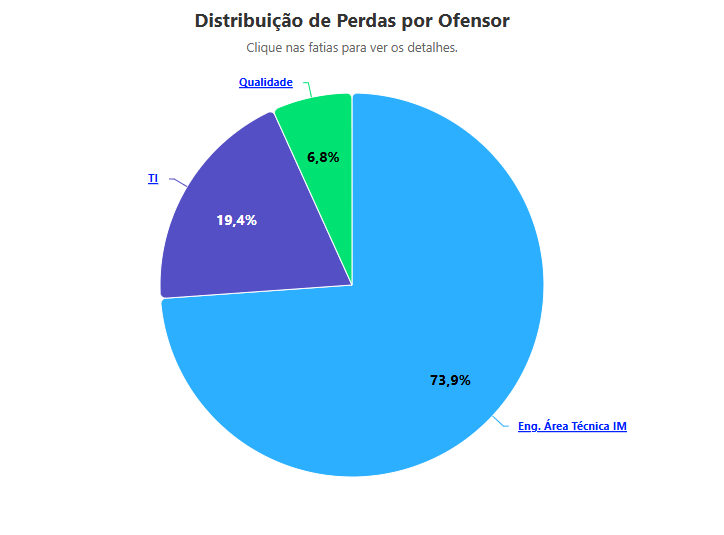
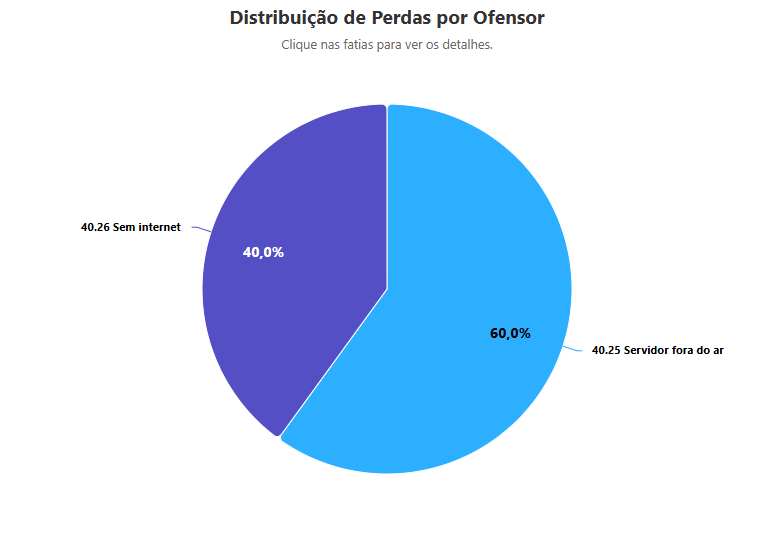
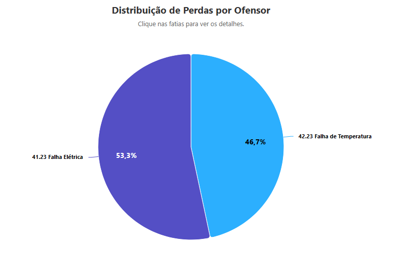
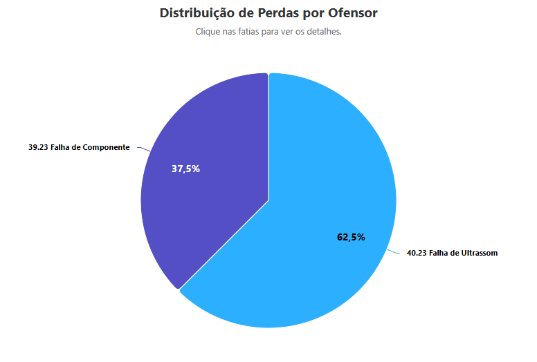

# 🚀 Guia de Inicialização do Projeto

Este guia descreve como configurar e levantar o projeto utilizando **Docker**.

## 🏗️ Construção da Imagem

Para construir a imagem Docker do projeto, utilize o seguinte comando:

```sh
docker build -t meu-projeto-php .
```

🔹 **Explicação dos parâmetros:**
- `-t meu-projeto-php` → Define um nome/tag para a imagem Docker.
- `.` → Especifica o diretório atual como contexto de construção.

## 📦 Criando e Executando o Container

Após construir a imagem, execute o seguinte comando para criar e rodar o container:

```sh
docker run -d -p 8080:80 -v $(pwd):/var/www/html --name meu-projeto meu-projeto-php
```

🔹 **Explicação dos parâmetros:**
- `-d` → Executa o container em modo **desacoplado** (em segundo plano).
- `-p 8080:80` → Mapeia a porta **8080** do host para a porta **80** do container.
- `-v $(pwd):/var/www/html` → Monta o diretório atual como volume dentro do container.
- `--name meu-projeto` → Define um nome para o container.

## 🌐 Acessando o Sistema

Após iniciar o container, o sistema estará disponível no navegador através do seguinte endereço:

🔗 [http://localhost:8080](http://localhost:8080)

## ⏹️ Parando o Container

Para interromper a execução do container, utilize o seguinte comando:

```sh
docker stop meu-projeto
```

## Exemplo da primeira camada:



## Exemplo da segunda camada (TI):



## Exemplo da segunda camada (Qualidade):



## Exemplo da segunda camada (Engenharia):



